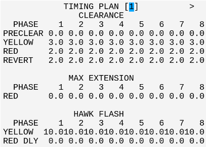
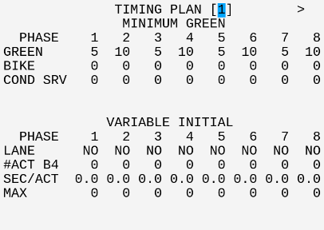
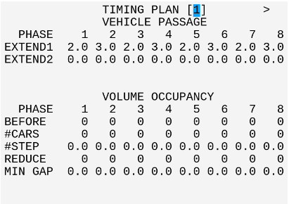
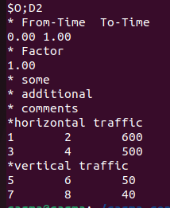
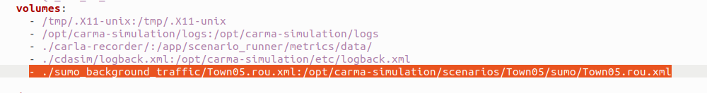

# Town05 TIM/TSP

## Introduction

This **CARMA Config** includes the docker-compose and configuration file setup for the **Town05 TIM/TSP** scenario.

## Scenario Description

This CARMA Configuration Image creates a **XIL** (Anything-In-the-Loop) scenario which includes **CARLA**, **SUMO** , **NS3** (CV2X Model), a **Virtual Signal Controller** and **CARMA Platform**.  The scenario takes place in an intersection in **CARLA Town 5** and spawns 1 **CARMA Platform Vehicle**. 

### Scenario: TIM/TSP

## Simulators

| Simulator      | Version |
| ----------- | ----------- |
| CARLA      | 0.9.10       |
| SUMO      | 1.15       |
| EVC       | 0.9.2 |

## EVC Configuration

The configuration shows above will apply to 421.cfg, 685.cfg and 965.cfg

## Sumo Background Traffic
This scenario starts with no background Sumo vehicles but route file for Sumo background traffic can be genrated and route files can be added as a docker volume in the `xil-Town05/docker-compose.ym'` to add sumo background traffic.

There are two options to generate the background traffic route file `Town05.rou.xml`  for this scenario:
1. Utilizing Sumo randomTrips.py to generate random traffic running in Sumo
2. Defining OD matrix and specify origin and destination along with number of vehicles running in Sumo

### Random Traffic using randomTrips.py
Run the script `generate_random_background_traffic.sh` in the `xil-Town05/cdasim_config/sumo_background_traffic/` to generate random background traffic. This script takes simulation duration, number of vehicicles and a random number seeds to genrate a route file mapping with Carla vehicle Types. The minimum straight line distance of the each vehicle route is atleast 300m. The script takes command line arguments as well as interactive input of simulation duration, number of vehicles and random number seed.

#### Prerequsites:
Sumo tools needs to be installed for running the following script. To install Sumo tools use the command:
`sudo apt-get install sumo-tools ` 

#### Running the script with Command Line Argument
Use the following command 

`./generate_random_background_traffic.sh simulation_duration number_of_vehicles random_number_seed` 

If command line argument is not provided the script asks for the simulation duration, number of vehicles , random number seed and genrates the `Town05.rou.xml` 

### Utilizing OD matrix to generate Background Traffic
The script `generate_route_from_OD_matrix.sh` in the `xil-Town05/cdasim_config/sumo_background_traffic/`  utilizes sumo od2trips ( https://sumo.dlr.de/docs/od2trips.html ) tool to generate background traffic for Town05 given Traffic assignment zones (TAZ) and OD matrix
#### Prerequisites
This script also requires Sumo tools od2trips and duarouter and sumo tools can installed  using the command:  sudo apt-get install sumo-tools (https://sumo.dlr.de/docs/Installing/index.html)
#### OD Matrix

1. To change the number of vehicles in the horizontal or vertical direction, modify the values in the third column of OD_file.od, which specify the number of vehicles
2. Re-run the generate_route.sh script to generate the route file with the updated vehicle count. defines the number of vehicles traveling between them.
3. New traffic Assignment zones (Tazs) can also be added in the `Taz.xml` and new Tazs can be used as origins and destinations in `OD_file.od` to genrate vehicle trips in those TAZs. For a detailed guideline, refer to SUMO od2trips documentation here  https://sumo.dlr.de/docs/od2trips.html

### Adding generated Town05.rou.xml to CDASim
To add Sumo background traffic generated follwoing either of the previous steps the `docker-compose.yml' files need to updated. To add the `Town05.rou.xml` route file open the `docker-compose.yml` file and add a docker volume using ` - ./sumo_background_traffic/Town05.rou.xml:/opt/carma-simulation/scenarios/Town05/sumo/Town05.rou.xml `. The updated volume in `docker-compose.yml` should like like as below:

This should replace the existing `Town05.rou.xml` with the newly genrated route file in CDASim and when the scenario is deployed the background traffic will appear in the scenario

## Deployment Instructions
### Deployment Steps
1) Copy all files in the `xil-Town05/cdasim_config/route_config/` directory to `/opt/carma/routes/`
2) Navigate to `xil-Town05` and `./build_image.sh` to build CARMA Config image. (Optional if remote image exists)
   1) `./build_image/sh` should print resulting image name
3) Run `carma config set <carma-config-image-name>`
4) Navigate to the `cdasim_config/` directory.
5) `./run_simulation` script clears all necessary volumes and containers and runs `carma start all`
6) Launch a second terminal and run `./stop_simulation` to stop the simulation and collect data.
### Locally Built Docker Images
The Virtual Signal Controller is built locally and currently only available to licenced users.
