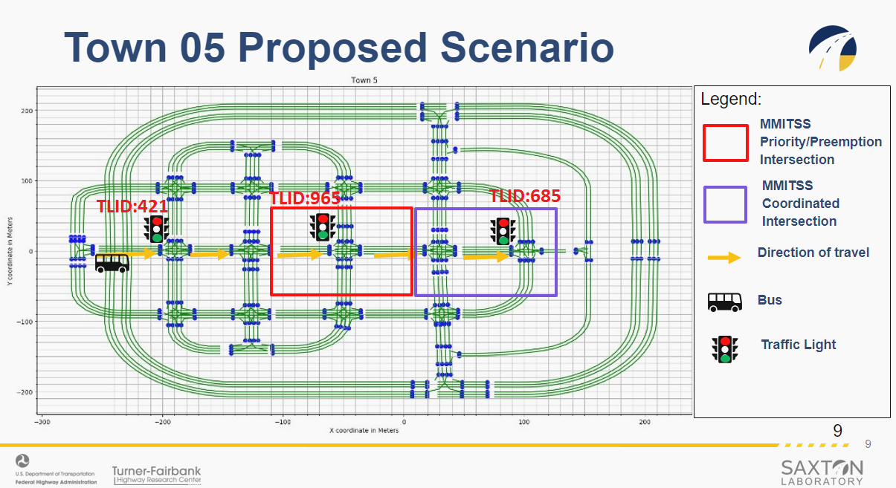

# Town05 TIM/TSP

## Introduction

This **CARMA Config** includes the docker-compose and configuration file setup for the **Town05 TIM/TSP** scenario.

## Scenario Description

This CARMA Configuration Image creates a **XIL** (Anything-In-the-Loop) scenario which includes **CARLA**, **SUMO** , **NS3** (CV2X Model), a **Virtual Signal Controller** and **CARMA Platform**.  The scenario takes place in an intersection in **CARLA Town 5** and spawns 1 **CARMA Platform Vehicle**. 

### Scenario: TIM/TSP

## Simulators

| Simulator      | Version |
| ----------- | ----------- |
| CARLA      | 0.9.10       |
| SUMO      | 1.15       |

## Deployment Instructions
### Deployment Steps
1) Copy all files in the `xil-Town05/cdasim_config/route_config/` directory to `/opt/carma/routes/`
2) Navigate to `xil-Town05` and `./build_image.sh` to build CARMA Config image. (Optional if remote image exists)
   1) `./build_image/sh` should print resulting image name
3) Run `carma config set <carma-config-image-name>`
4) Navigate to the `cdasim_config/` directory.
5) `./run_simulation` script clears all necessary volumes and containers and runs `carma start all`
6) Launch a second terminal and run `./stop_simulation` to stop the simulation and collect data.
### Locally Built Docker Images
The Virtual Signal Controller is built locally and currently only available to licenced users.
