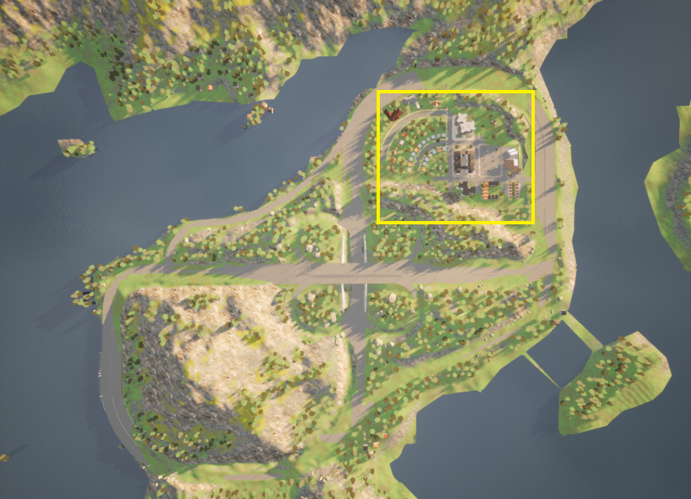
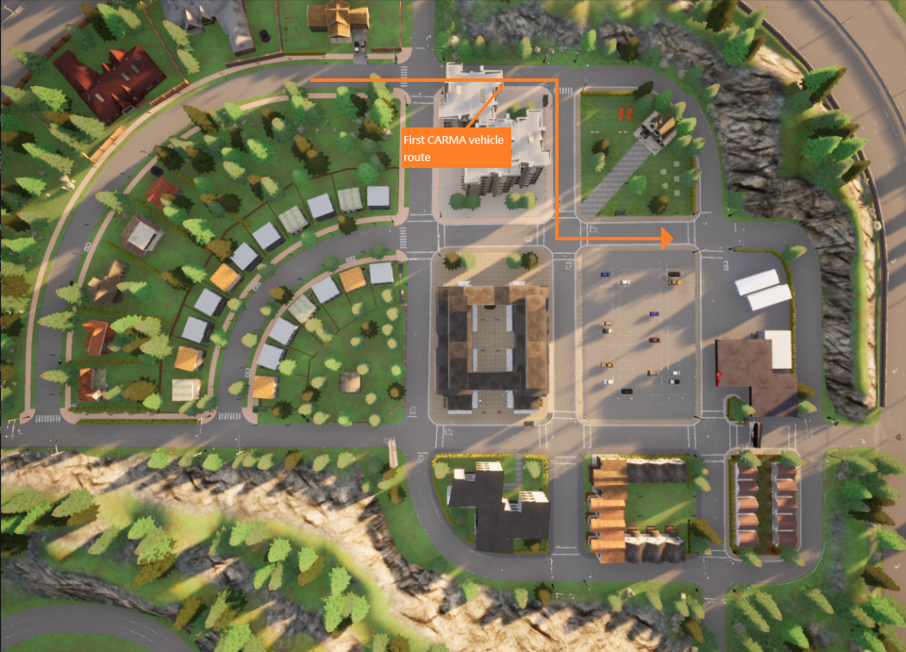
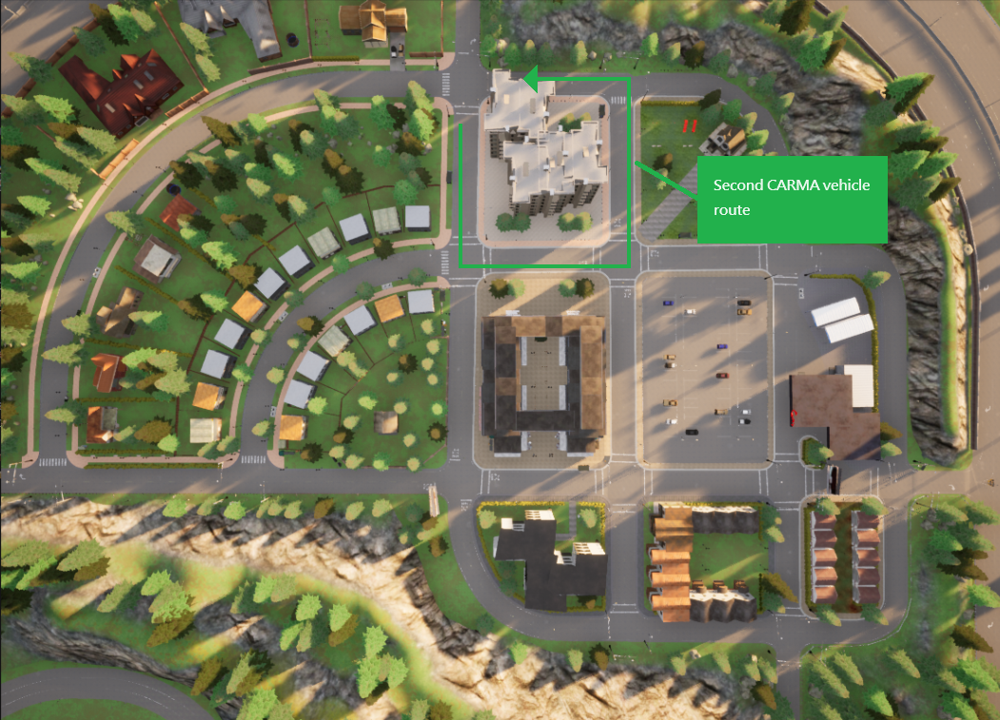

# CDASim CARMA Basic Lanefollow Scenario

## Introduction

This **CARMA Config** includes the docker-compose and configuration file setup for the **CDASim with CARMA Basic Lanefollow Scenario**.

## Scenario Description

This CARMA Configuration Image creates a **XIL** (Anything-In-the-Loop) scenario which includes **CARLA**, **SUMO**, and **CARMA Platform**. The scenario configured is meant to show base basic CDASim functionality. There are other configurations that enable infrastructure computation and communication, traffic control, and carma-cloud, which are not included here. That said, these components can be added to this configuration following the patterns from other configurations. This component provides an interface for CDA participants to interact with the road infrastructure.

## Simulators

| Simulator      | Version |
| ----------- | ----------- |
| CARLA      | 0.9.10       |
| SUMO      | 1.15       |

## Deployment Instructions

1) Copy all files in the `cdasim_config/route_config` directory to directory to `/opt/carma/routes/`
2) Copy the osm map in `cdasim_config/carma/` directory to `/opt/carma/maps/` and create a symbolic link to it named `vector_map.osm`
3) Install carma-script extension (see instructions in [Setup CARMA Scripts](https://usdot-carma.atlassian.net/wiki/spaces/CRMPLT/pages/488472599/Setup+CARMA+Platform+Runtime))
4) Build or pull carma-config image and run `carma config set <image_name>`

5.a) Before step 5, if you need Rviz to work for visualization (optional), please git clone carma-platfrom repo
`mkdir -p ~/carma_ws/src/`
`git clone https://github.com/usdot-fhwa-stol/carma-platform ~/carma_ws/src/carma-platform`
5.b) Start the simulation only from the `cdasim_config` folder. Run `./start_simulation` script, which will automatically start rviz as well by default.
6) Finish the simulation either by ctrl + c once, or `./stop_simulation` script from `cdasim_config` as well. This will also pull in rtf data, which says info about simulation speed.
