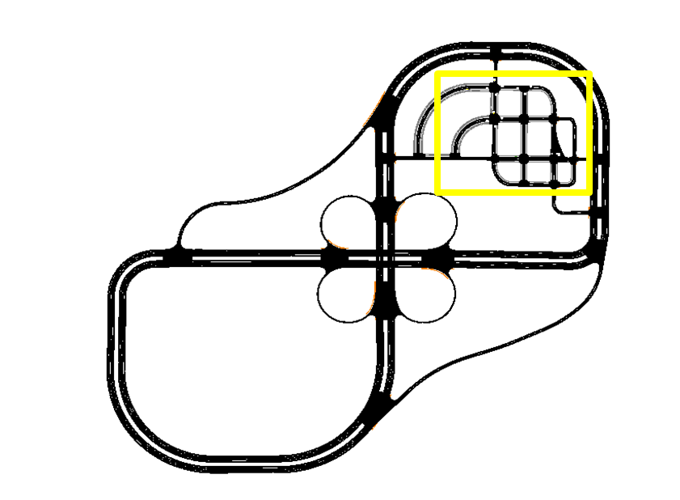
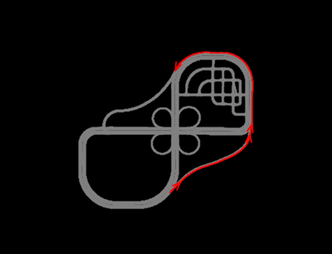

# CARMA Messenger CDASim Integration Scenario

## Introduction

This **CARMA Config** includes the docker-compose and configuration file setup for the **CARMA Messenger CDASim Integration Scenario**.

## Scenario Description

This CARMA Configuration Image creates a **XIL** (Anything-In-the-Loop) scenario which includes **CARLA**, **SUMO** , **NS3** (CV2X Model), a **Virtual Signal Controller**, **CARMA Streets**, **CARMA Cloud** and **CARMA Platform**. The scenario configured is meant to show base basic CDASim functionality along with the new developed **CARMA Messenger** integration. **CARMA Cloud** is a cloud application used to maintain and provide traffic controls for autonomous vehicles to use to update their local maps. The diagrams below illustrate the configured scenario including vehicle routes and infrastructure location.**CARMA Messenger** is a standalone research platform which is aimed to deploy on non-automated entities who participate in the transportation system, including first responders, transit vehicles, law enforcement vehicles, and pedestrians.

## Simulators

| Simulator      | Version |
| ----------- | ----------- |
| CARLA      | 0.9.10       |
| SUMO      | 1.15       |

## Deployment Instructions

1) Copy all files in the `cdasim_config/route_config` directory to  directory to `/opt/carma/routes/` and to `/opt/carma-messenger/messenger_1/routes/`
2) Copy the osm map in `cdasim_config/carma/` directory to `/opt/carma/maps/` and create a symbolic link to it named `vector_map.osm`

3) Build Virtual Signal Controller image locally (see instructions in [Setup CARMA Config](https://usdot-carma.atlassian.net/wiki/spaces/CRMSIM/pages/2526937089/Setup+Instructions+Documentation+CARMA-Streets+Integration) step 1 )
4) Install carma-script extension (see instructions in [Setup CARMA Scripts](https://usdot-carma.atlassian.net/wiki/spaces/CRMPLT/pages/488472599/Setup+CARMA+Platform+Runtime))
5) Build or pull carma-config image and run `carma config set <image_name>`
6) Create a symlink from `carma-messenger-config/example_calibration_folder/vehicle` to `/opt/carma-messenger/messenger_1/vehicle`.
7) Navigate to the `cdasim_config/` directory and run the `start_simulation` script
8) To stop the simulation simply run the `stop_simulation` script in the same directory (ensure any kafka data from carma streets is collected before stopping simulation)
9) This scenario can generate a lot of logged data, using the `clear_logs` script in the same directory will clear **CDASim**, **CARMA Streets**, **CARMA Platform Logs**, **CARMA Messenger** and **CARMA Cloud** logs.
